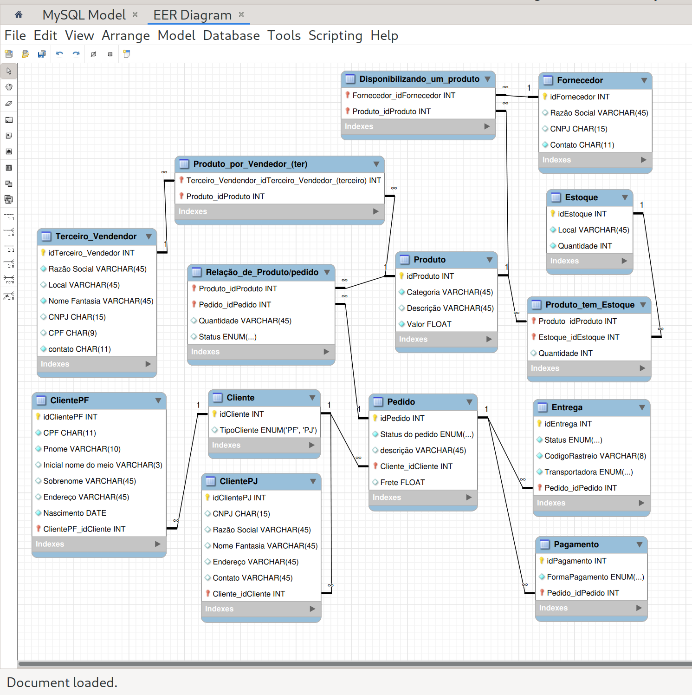

<h1>
    
    Suzano - Análise de Dados com Power BI 
</h1>

# :computer: Desafio de projeto: Refinando um Projeto Conceitual de Banco de Dados – E-COMMERCE

Dado o cenário de e-commerce em que:

- Produto:
    - Vendidos por uma única plataforma
    - Podem ter vários vendedores 
    - Possui apenas 1 fornecedor
    - Um ou mais produtos compõem um pedido

- Cliente
    - Pode ser CPF ou CPNPJ
    - Endereço determina o valor do frete
    - Pode fazer mais de um pedido

- Pedido
    - Criados por clientes, possui informação de compra, endereço e status da entrega
    - Um ou mais produtos
    - Pode ser cancelado 

Narrativa: Fornecedor e Estoque 

Um modelo base foi apresentado pela instrutora.  

## Refine o modelo apresentado acrescentando os seguintes pontos:

- Cliente PJ e PF: Uma conta pode ser PJ ou PF, mas não pode ter as duas informações;

- Pagamento: Pode ter cadastrado mais de uma forma de pagamento;

- Entrega: Possui status e código de rastreio;

# :bulb: Solução do desafio

A solução é baseada no meu [projeto](https://github.com/tsdes-santiago/DIO_Bootcamp_ecommerce).

## Esquema relacional:
    
- DiagramaEcommerce.png
- e_commerce_diagrama.mwb (Arquivo Workbench)

- **Cliente PF e PJ**:

     Adicionei as tabelas ClientesPF, ClientesPJ e uma tabela auxiliar Cliente que seleciona o cliente do pedido. 

- **Pagamento**:

    Adicionei as tabelas Pagamento, em que se tem a forma de pagamento associado a um pedido.
    
- **Entrega**:

    Adicionei a tabela Entrega, relacionada a um pedido, que possui código de rastreio, status e a transportadora.

