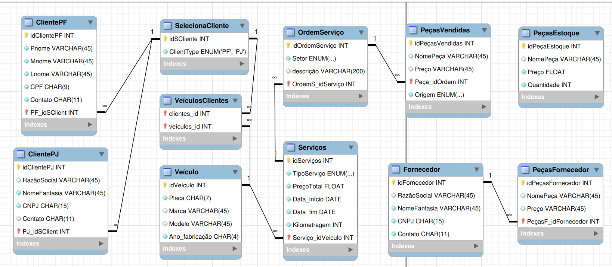

<h1>
    
    Suzano - Análise de Dados com Power BI 
</h1>

# :computer: Desafio de projeto: Construindo um Esquema Conceitual para Banco De dados

O Objetivo desse desafio é criar o esquema conceitual para o contexto de oficina mecânica com base na narrativa fornecida

**Narrativa**:

- Sistema de controle e gerenciamento de execução de ordens de serviço em uma oficina mecânica
- Clientes levam veículos à oficina mecânica para serem consertados ou para passarem por revisões  periódicas
- Cada veículo é designado a uma equipe de mecânicos que identifica os serviços a serem executados e preenche uma OS com data de entrega.
- A partir da OS, calcula-se o valor de cada serviço, consultando-se uma tabela de referência de mão-de-obra
- O valor de cada peça também irá compor a OS 
- O cliente autoriza a execução dos serviços
- A mesma equipe avalia e executa os serviços
- Os mecânicos possuem código, nome, endereço e especialidade
- Cada OS possui: n°, data de emissão, um valor, status e uma data para conclusão dos trabalhos.

# :bulb: Solução do desafio

A solução é baseada no meu [projeto](https://github.com/tsdes-santiago/DIO_bootcamp_oficina).

## Esquema relacional:
    
- oficinaDiagrama.png
- oficina_diagrama.mwb (Arquivo Workbench)

- As tabelas PeçasEstoque e PeçasFornecedor possuem as peças disponíveis para consulta de preço, podem variar com o tempo. A tabela PeçasVendidas registra a peça e valor usada em uma ordem de serviço, seus dados não variam.

- Como um cliente pode ter mais de um veículo, criei a tabela auxiliar VeículosClientes que registra qual veículo pertence a qual cliente. Cada ordem de serviço é referente a um veículo.

- Adicionei as tabelas ClientesPF, ClientesPJ e uma tabela auxiliar Cliente que seleciona o cliente do pedido. 